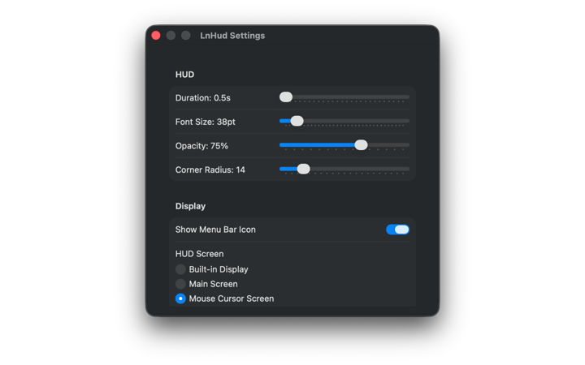
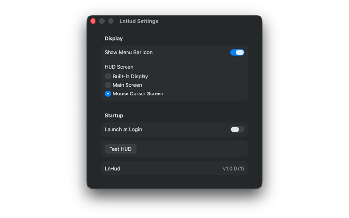

# LnHud

A lightweight macOS menu bar utility that displays a HUD (Heads-Up Display) overlay when you switch keyboard input sources.

Never wonder which language you're typing in — LnHud shows you at a glance.

## Screenshots






## Features

- **Instant HUD** — Displays the current input source name (e.g., "한국어", "English", "日本語") as a large overlay in the center of the screen whenever you switch keyboard layouts
- **Fully Customizable** — Adjust HUD duration, font size, corner radius, opacity, position (9-grid), and background color (system vibrancy, 8 presets, or custom color picker)
- **Per-Language Color** — Assign different HUD colors for each keyboard input source, or sync all languages to one color
- **Multi-Monitor Support** — Choose where the HUD appears: built-in display, main screen, or the screen where your mouse cursor is
- **Menu Bar App** — Runs quietly in the menu bar with no Dock icon. Menu bar icon can be hidden if preferred
- **Launch at Login** — Start automatically when you log in
- **Privacy First** — No network access, no analytics, no data collection. Runs entirely offline
- **App Sandbox** — Mac App Store ready with minimal permissions

## Requirements

- macOS 13.0 (Ventura) or later
- Apple Silicon (arm64) or Intel (Universal Binary)

## Installation

**Mac App Store** — Coming soon

**Manual Build:**

```bash
# Install xcodegen if needed
brew install xcodegen

# Generate Xcode project and build
xcodegen generate
xcodebuild -project LnHud.xcodeproj -scheme LnHud -configuration Release build

# Run tests
xcodebuild -project LnHud.xcodeproj -scheme LnHud test
```

## Settings

| Setting | Range | Default |
|---------|-------|---------|
| Duration | 0.5 – 3.0s | 1.0s |
| Font Size | 10 – 96pt | 64pt |
| Corner Radius | 8 – 48 | 24 |
| Opacity | 30% – 100% | 90% |
| Position | 9-grid (3×3) | Center |
| Offset X / Y | -200 – 200 | 0 |
| Color Mode | System / Preset / Custom | System |
| Preset Colors | Dark, Graphite, Navy, Indigo, Teal, Forest, Berry, Brown | — |
| Sync All Languages | On / Off | On |
| HUD Screen | Built-in / Main / Mouse Cursor | Built-in |
| Menu Bar Icon | On / Off | On |
| Launch at Login | On / Off | Off |

## Project Structure

```
Sources/LnHud/
├── App/            # App entry point, AppState, URL scheme handler
├── Settings/       # AppSettings (UserDefaults-backed)
├── HUD/            # HUDPanel (NSPanel), HUDController (state machine)
├── Input/          # InputSourceReader (TIS API), InputSourceMonitor
├── UI/             # MenuBarMenu, PreferencesView
└── Services/       # LoginItemService (SMAppService)
```

## How It Works

1. `InputSourceMonitor` listens for keyboard input source changes via `DistributedNotificationCenter`
2. `InputSourceReader` reads the current source name using Carbon TIS API
3. `HUDController` manages a state machine (idle → fadeIn → visible → fadeOut → idle) and displays the text via `HUDPanel`
4. `HUDPanel` is a borderless `NSPanel` using `NSVisualEffectView` + `NSTextField` — pure AppKit with no Auto Layout

## Privacy

LnHud does not collect, store, or transmit any data. See [Privacy Policy](PRIVACY.md).

## License

MIT
